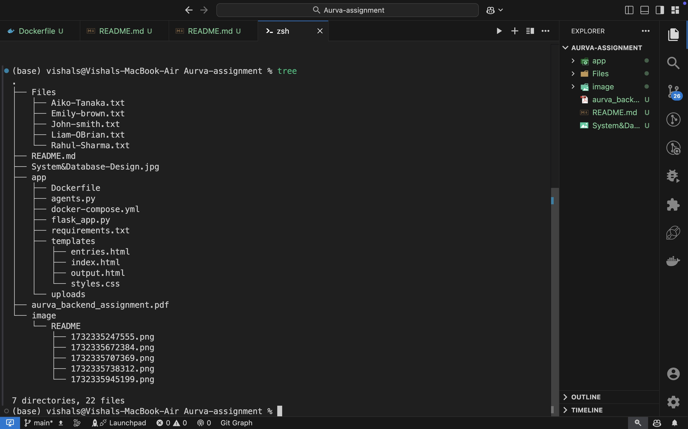
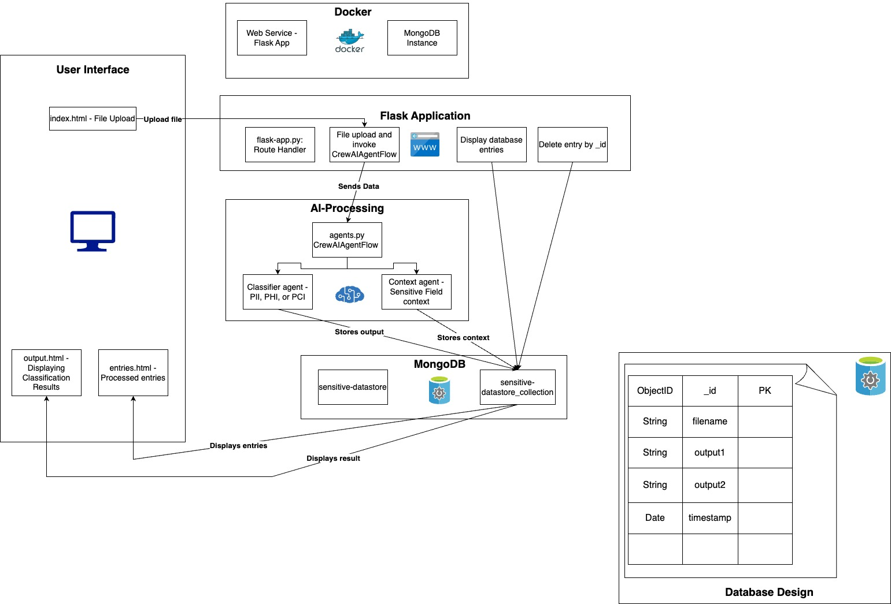
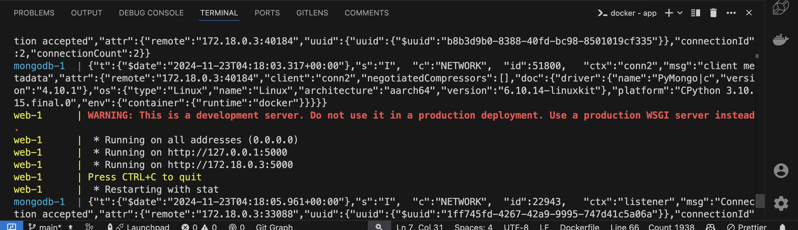
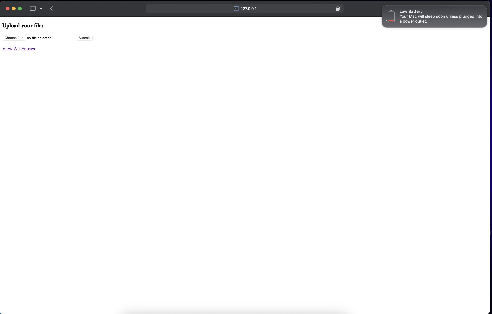
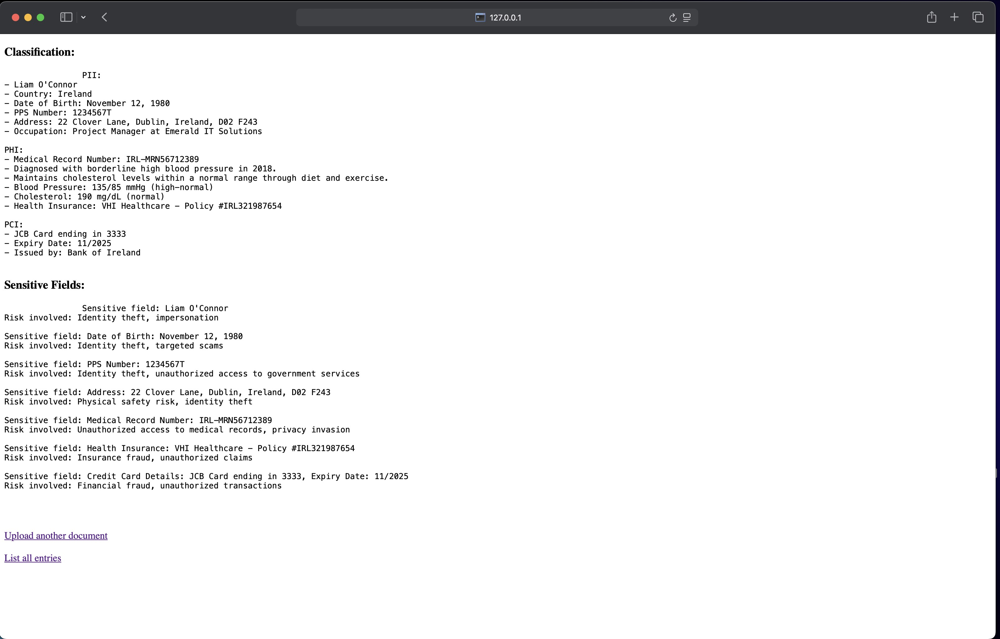
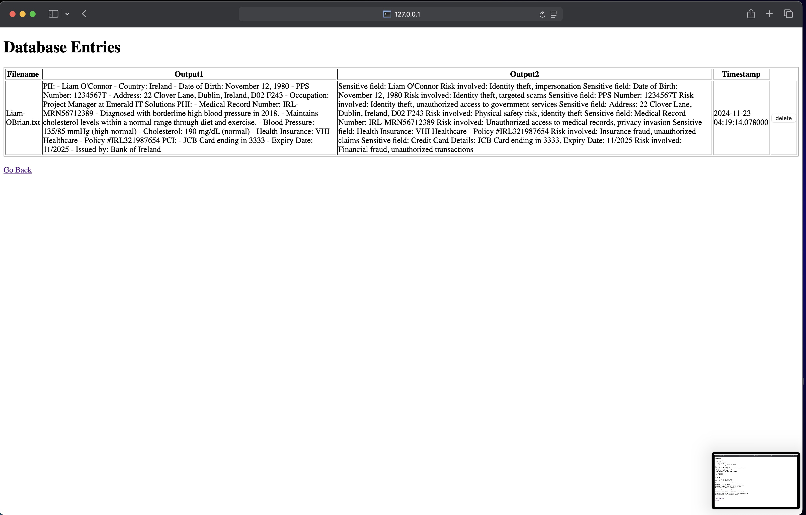

# Sensitive Data Classifier

This project classifies sensitive data from uploaded documents using AI agents and provides context on the sensitive fields found.

## Prerequisites

- Docker
- Docker Compose

## Project File Structure



## Steps to Run the Project

1. **Please Make sure Docker and Docker Compose is there.**
2. **Open the terminal in the app directory.**
3. **Create a `.env` file in the `app` directory with the following content.**

   ```env
   OPENAI_API_KEY=your_openai_api_key
   ```
4. **Build and run the Docker containers:**

   ```sh
   docker compose up --build
   ```
5. **Access the application:**

   Once the project is up and running,
   Open your web browser and go to `http://127.0.0.1:5000`.
6. **Upload a document:**

   - Click on "Choose File" and select a text file to upload.
   - Click on "Submit" to classify the data and get the context on sensitive fields.
7. **View entries:**

   - Click on "View All Entries" to see the list of all uploaded documents and their classification results.
8. **Delete an entry:**

   - Click on the "delete" button next to an entry to remove it from the database.

## Project Structure

- `app/`: Contains the main application code.
  - `agents.py`: Defines the AI agents and tasks.
  - `flask_app.py`: The Flask application.
  - `templates/`: HTML templates for the web interface.
  - `Dockerfile`: Dockerfile to build the application image.
  - `docker-compose.yml`: Docker Compose configuration.
  - `requirements.txt`: Python dependencies.
- `Files/`: Sample documents for testing. Use these text files for uploading.

## Notes
- **The MongoDB database is configured to run in a Docker container and store data in the `./data` directory.**

## System Design and Database Design



## UI Screenshots

- The terminal output:

  
- Upload Screen:

  
- Result of the uploaded file:

  
- Database Entries:

  
